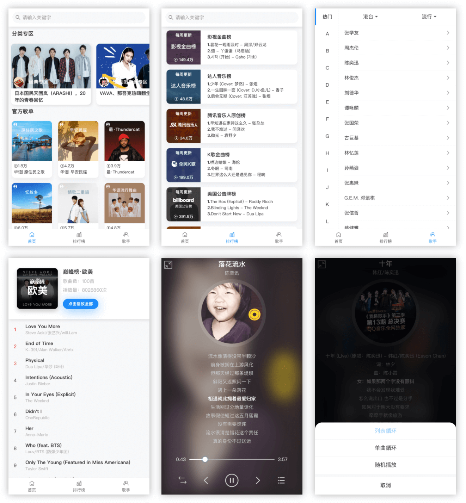

本项目基于 Vue 2.x && VantUI，构造的音乐webapp，后台采用的是QQ音乐接口，部署时需要在服务器做对应的代理。项目逻辑基本覆盖vue中绝大部分特性，非常适合入门vue进行练手。

### Install && Publish

推荐使用`yarn`进行安装依赖，然后开发

```bash
npm install -g yarn
yarn
```

打包发布

```bash
yarn build
```

具体部署代理规则，可看我提供的nginx配置

### Preview



### Feat

1. 专辑、排行榜和首页歌单。
2. 搜索歌手/歌曲，热搜词汇。
3. 播放器播放歌曲 && 迷你播放器。
4. 三种播放模式 && 历史播放列表。
5. 接口分页`Mixin`，抽象分页请求的逻辑 + 自定义命名空间。
6. 数据层：`adapter` + `service`接口，良好的数据过滤与清洗。
7. 页面缓存 + 布局配置
8. ...

### Online

